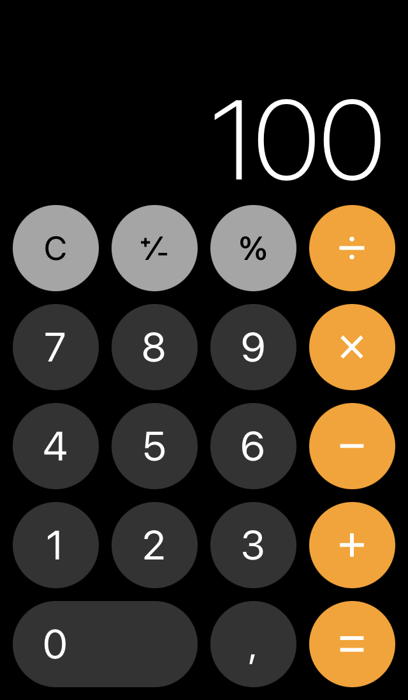

# Assignment instructions:

- Implement a simple calculator app that can perform sum, subtract, multiply and division calculations.  
- Use HTML5/CSS/JavaScript for the implementation.   
- Pay attention to reusable and clean code, and practical and purposeful UI.
- Optional task: plan sufficient test cases to cover the application on a reasonable level.

## Calculator features.
- perform sum, substract, multiply and divide
- the UI approach and buttons I used are based on the iphone calculator, which I assume is the most used "simple calculator" in the world: you can also clear, 
 I added one button to the iphone version: the "Del", which does like "Delete" on your keyboard: deletes 1 character.

    

- you can either type or press the buttons,
- the colors, font and style is based on Neomore's web,
- only used vanilla HTML5/CSS/JavaScript for the implementation.
- can keep adding operands, not limited to 1, 2 or 3.
- can press on "=", then if choose an operand the calculation continues
- if divides by = 0, Error message appears "Error: Cannot Divide by 0"
- decimals: up to 12 decimals, as from 14 decimals we have observed some strange behaviors in some cases. It is apparently inherent to computers and its management of floats after some research.
- upper limit: from e+80, or 10^80, the last integer before the exponent of 10 again has some similar weird behavior as when asking for 12+ decimals.

## Bonus: Automated testing and planned test cases

### 5 test cases have been automated:
- using the functions appendNumber(), chooseOperation(), compute() and clear. 
- Each of the 4 operands is tested, along with the divived by 0 error case, as well as dividing 10 by 3 and checking for the max number of decimals, as well as multiplying 2 big numbers. 
- Click the "Run Tests" button and the results will be displayed. 
- I have created a runTest() function which you can easily adapt. Its limitation is that it is made for one operand, and does not test the UI of course.

### 5 test cases are recommended to manually test:
-  keep doing operations and adding operands, testing each operand --> ex: 1 + 2 * 3 - 4 / 5 ...
-  press C to clear
-  compute an operation pressing "=" then press on an operand to continue calculating with the result, 
-  compute an operation pressing "=" then press on a number to start a new operation,
-  press operands several times, change type -> the operand taken into account will be the last
